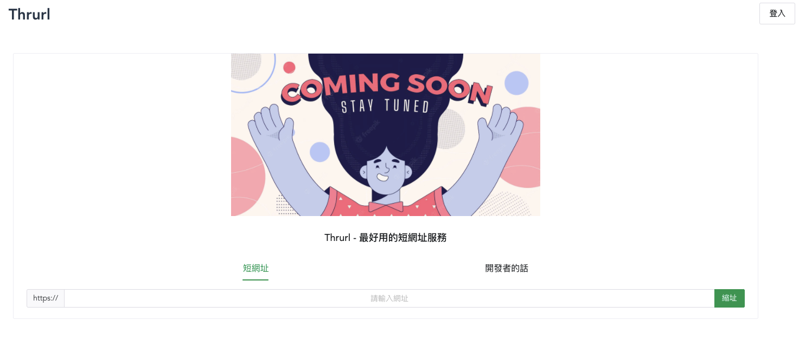
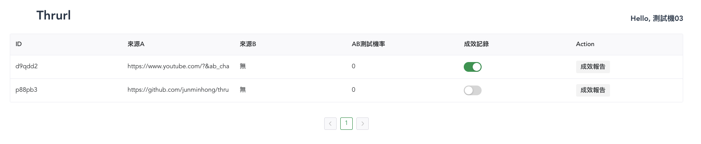
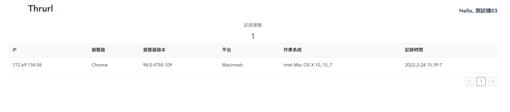
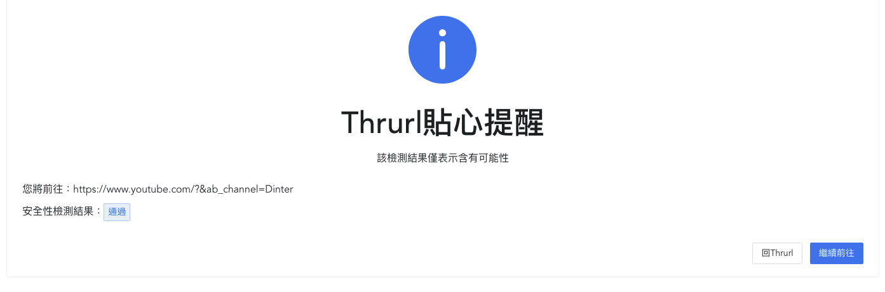

## Thrurl Center
基於Golang開發的一個簡單且易用的開源短網址服務。

## 特點
- 簡單且輕鬆就能將漏漏長的網址縮短
- 基於安全性，提供導向前分析目標連結是否為高風險
- 搭配Redis，讓轉址更有效率
- 提供點擊成效，輕鬆分析來源客群
- 提供AB測試
- 基於DDD架構開發
- 輕鬆一點就能讓圖片也變成短網址
- 提供密碼保護功能，增加隱私性
- 提供密碼提示，再也不容易輕易忘記密碼了
- 提供有效期限設定，時間到就看不到嘍

## Demo
[API DOC](https://thrurl-center.jmh-su.com/swagger/index.html)

[Demo - coming soon](https://thrurl.jmh-su.com)

### Home

### 短網址中心

### 點擊成效報告

### 導向前檢查網址安全性

## 已完成功能
- [X] 縮短網址
- [X] 安全性分析
- [x] 點擊成效
  - IP
  - 使用的瀏覽器
  - 使用的瀏覽器版本
  - 使用的平台
  - 使用的系統
- [x] AB測試
  - 可設定B出現的機率，A出現機率為(100-B出現機率)%

## Feature
- [ ] 圖片短網址
  - 檔案限制大小10MB
  - 密碼保護最多6碼
  - 密碼提供功能
  - 有效期限設定
- [ ] 影片短網址
  - 檔案限制大小20MB
  - 密碼保護最多6碼
  - 密碼提供功能
  - 有效期限設定
- [ ] 語音短網址
  - 檔案限制大小10MB
  - 密碼保護最多6碼
  - 密碼提供功能
  - 有效期限設定